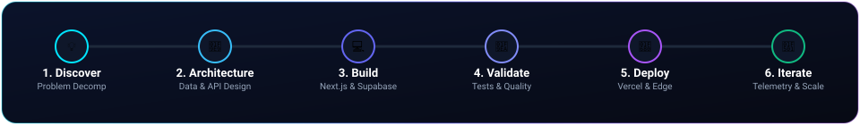

<!-- ============================================================
     HERO / BANNER SECTION
============================================================ -->

  

# 👋 Hey, I'm **Elango S**

### `Full-Stack Developer` • `Prompt Engineer` • `AI Explorer` • `Problem Solver`

  

  

<!-- ============================================================
     ABOUT ME SECTION
============================================================ -->

## 🧑‍💻 About Me

  
  
  
  

  

I am a hands-on **Full-Stack Developer** and **AI Engineer** based in Bengaluru, India. I specialize in engineering responsive modern web applications, integrating practical AI/LLM capabilities into software workflows, and designing structured prompts that yield predictable, production-grade results.

From architecting competitive programming arenas with multi-language execution to deploying client e-commerce platforms and high-throughput media engines, my focus is always on writing clean code, designing solid architectures, and shipping real-world software.

- 💻 **Engineering Stack**: TypeScript, JavaScript, React 19, Next.js 16, Node.js, Express, PostgreSQL, Prisma, Supabase
- 🧠 **AI & Automation**: Prompt Architecture, Structured LLM Outputs, OpenAI API Integration, AI-Assisted Workflows
- 🎯 **Engineering Mantra**: `Build → Experiment → Learn → Ship → Improve`

  

<!-- ============================================================
     WHAT I'M CURRENTLY BUILDING
============================================================ -->

## 🚀 Currently Building

- 🎓 **[KalviLearn](https://kalvilearn.vercel.app)** — An advanced competitive programming education platform featuring 85 Belt Mastery problems, a 10-module curriculum (89 learning units), an anti-cheat Monaco code arena with keyboard shortcut interception, and client-side multi-language code evaluation.
- 🛍️ **[ZYRØCORE](https://www.zyrocore.in)** — A real-world client e-commerce platform built for an Indian streetwear and lifestyle apparel brand based in Tamil Nadu (*"Stop Following The Trend. Be Timeless."*). Features product collection discovery, cart/wishlist management, customer accounts, and Razorpay checkout.

  

<!-- ============================================================
     FEATURED PROJECTS
============================================================ -->

## 📌 Featured Projects

<table>
<tr>
<td width="50%" valign="top">

### 🎓 KalviLearn

**Gamified Competitive Programming Platform**

A production-grade algorithmic learning platform featuring **85 Belt Mastery Problems**, a **10-Module Curriculum (89 Learning Units)**, strict anti-cheat Monaco code arena, and an in-browser code evaluation engine.

- **Frontend**: React 19 • TypeScript • Vite • Tailwind CSS
- **Code Arena**: Monaco Editor (shortcut & context interception)
- **Backend & DB**: Prisma ORM • Supabase PostgreSQL • Vercel
- **Features**: Multi-language evaluation, Revise Vault, XP & Streaks

[Live Demo →](https://kalvilearn.vercel.app) • [View Source →](https://github.com/sivakumarelango10-art/KalviLearn)

</td>

<td width="50%" valign="top">

### 🛍️ ZYRØCORE

**Real-World Client E-Commerce Platform**

A production-oriented full-stack e-commerce platform developed for **ZYRØCORE**, an Indian streetwear and lifestyle apparel brand based in Tamil Nadu (*"Stop Following The Trend. Be Timeless."*). Provides a modern storefront for browsing collections, managing carts and wishlists, handling customer accounts, and processing secure payments.

- **Stack**: Next.js 16 • React 19 • TypeScript • Tailwind CSS
- **Backend & DB**: Supabase • PostgreSQL • Razorpay API
- **Features**: Product catalog & category filters, cart & wishlist, order tracking
- **Deployment**: Vercel Production Environment

[Live Demo →](https://www.zyrocore.in) • [View Source →](https://github.com/sivakumarelango10-art/zyrocore)

</td>
</tr>

<tr>
<td width="50%" valign="top">

### 🎥 ReelTube

**High-Throughput Media Processing Pipeline**

A high-performance media pipeline and stream resolution engine that processes and extracts HD video/audio streams through edge-cached REST endpoints with client-side queueing.

- **Stack**: Next.js • React • TypeScript • Tailwind CSS
- **Architecture**: Edge-cached REST endpoints • Stream resolving
- **Performance**: Sub-second resolution • Responsive media player
- **Deployment**: Vercel

[Live Demo →](https://v0-mediagrab.vercel.app/) • [View Source →](https://github.com/elangoss121-dev/v0-media-downloader)

</td>

<td width="50%" valign="top">

### 🛍️ Kangeyan Heritage

**Performance-Optimized E-Commerce Web**

A responsive e-commerce platform built for a heritage apparel brand. Achieves fast page loads through static pre-rendering, responsive image pipelines, and a streamlined mobile-first checkout architecture.

- **Stack**: Next.js • React • TypeScript • Tailwind CSS
- **Features**: Dynamic category filtering, cart management, responsive UI
- **Optimization**: Static site generation • Image optimization
- **Deployment**: Vercel

[Live Demo →](https://kangeyan-heritage.vercel.app) • [View Source →](https://github.com/elangoss121-dev/Kangeyan-Heritage)

</td>
</tr>

<tr>
<td colspan="2" valign="top">

### 📊 NextGen Learning Dashboard

**Telemetry & Analytics Portal**

An interactive learning analytics portal featuring live student progress telemetry, custom milestone tracking, and modular chart widgets built on a state-driven reactive architecture.

- **Stack**: Next.js • React • TypeScript • Tailwind CSS
- **Visualization**: Chart components • Metric scorecards
- **Features**: Modular widgets, resilient API state management
- **Deployment**: Vercel

[Live Demo →](https://nextgen-learning-dashboard-delta.vercel.app/dashboard) • [View Source →](https://github.com/elangoss121-dev/nextgen-learning-dashboard)

</td>
</tr>
</table>

  

<!-- ============================================================
     TECH STACK
============================================================ -->

## 🛠️ Tech Stack

### 💻 Languages

  

### ⚛️ Frontend

  

### ⚙️ Backend & APIs

  

### 🗄️ Databases & ORM

  

### 🤖 AI & Prompt Engineering

  
  
  

### 🔧 Development Tools & DevOps

  

  

<!-- ============================================================
     AI & PROMPT ENGINEERING
============================================================ -->

## 🧠 AI & Prompt Engineering

Prompt engineering is not just asking questions—it is system engineering with natural language. I design predictable, reproducible AI pipelines integrated directly into application workflows:

- **Structured Prompt Architecture**: Crafting multi-layered system instructions with strict constraints, role definitions, few-shot examples, and schema-enforced output formatting.
- **Master Prompts & Reusable Templates**: Building reusable prompt templates for automated test synthesis, code explanation, code review, and legacy refactoring.
- **Application Integration**: Connecting LLM endpoints with backend controllers, leveraging JSON schema modes and function calling for programmatic reliability.
- **AST-Aware Code Prompting**: Feeding Abstract Syntax Tree (AST) context into language models to ensure generated unit tests adhere to accurate module signatures.
- **Developer Workflow Optimization**: Using generative AI as a force multiplier for rapid prototyping, edge case discovery, and test coverage expansion.

  

<!-- ============================================================
     HOW I BUILD (DEVELOPMENT WORKFLOW)
============================================================ -->

## 🧠 How I Build

  

| Phase | Focus | Engineering Practices |
| :--- | :--- | :--- |
| **💡 1. Discover** | Domain & Problem Mapping | Decompose requirements, identify user journeys, define edge cases |
| **🧩 2. Architecture** | System & Data Design | Relational schema design (PostgreSQL), API contracts, auth & state |
| **💻 3. Build** | Full-Stack Implementation | Modern React 19 / Next.js 16, TypeScript safety, modular components |
| **🧪 4. Validate** | Testing & Quality | In-browser test runners, AST validations, linting, error boundaries |
| **🚀 5. Deploy** | Production Delivery | Serverless edge functions, Vercel cloud, asset caching, CDN |
| **🔁 6. Iterate** | Refine & Scale | Telemetry feedback, performance profiling, prompt optimization |

  

<!-- ============================================================
     HACKATHONS & CHALLENGES
============================================================ -->

## 🏆 Hackathons & Challenges

I love participating in hackathons and competitive developer events because they mirror real-world software engineering under pressure:

- **Rapid MVP Delivery**: Going from problem statement to working deployed product within tight time windows.
- **Cross-Functional Collaboration**: Coordinating architecture decisions, code reviews, and interface contracts seamlessly.
- **Problem Solving & Resourcefulness**: Prioritizing core high-impact features, writing resilient code, and debugging under deadlines.
- **Practical Impact**: Focusing on tools and platforms that solve real user and developer pain points.

  

<!-- ============================================================
     GITHUB ACTIVITY & STATS
============================================================ -->

## 📊 GitHub Activity

  

  

  

<!-- ============================================================
     GOALS FOR 2026
============================================================ -->

## 🎯 Goals for 2026

- [x] 🚀 Build and ship production-ready full-stack web applications
- [x] 🎓 Design and launch **KalviLearn** with interactive in-browser coding
- [x] 🛍️ Ship **ZYRØCORE** client e-commerce platform to production
- [ ] 🏆 Participate in major collegiate and national hackathons
- [ ] 📚 Deepen mastery in distributed system design and database indexing
- [ ] 🌐 Contribute to high-impact open-source developer tooling
- [ ] 📦 Publish reusable component and prompt libraries for developers
- [ ] 🤝 Collaborate with developers globally to ship real-world software

  

<!-- ============================================================
     LET'S BUILD SOMETHING (COLLABORATION & CONTACT)
============================================================ -->

## 🤝 Let's Build Something

Interested in building useful products, experimenting with AI capabilities, or collaborating on meaningful full-stack software? Feel free to reach out!

 

<!-- ============================================================
     ANIMATED FOOTER
============================================================ -->

### 💭 *"Build things that matter. Learn from what breaks. Keep shipping."*

 

⭐ **If you find my projects useful or interesting, feel free to explore and star the repositories!**

 

  

  

